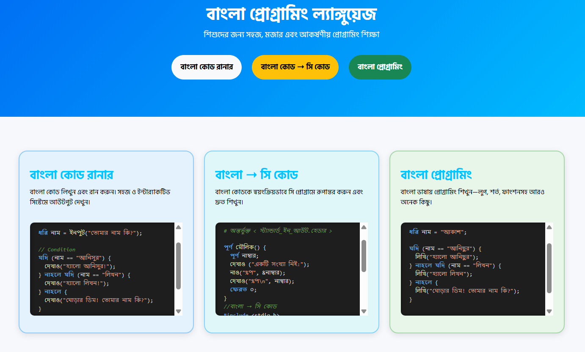

# Bangla Programming Language

> শিক্ষার্থীদের জন্য সহজ, মজার এবং আকর্ষণীয় প্রোগ্রামিং শিক্ষা। কোড রান, আউটপুট, কথা বলা, ছবি আঁকাসহ সাপ খেলা ইত্যাদি।
> রিলিজ ২০২০ সাল। প্রতিনিয়ত আপডেট হচ্ছে। বর্তমান ভার্সন ৪.৬(সর্বশেষ আপডেট মার্চ ২০২৬)।

